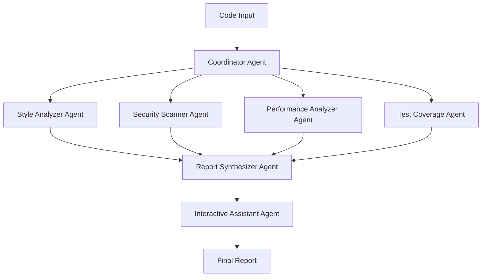

# Design Document

## Overview

The Code Review Assistant is designed as a multi-agent system using existing frameworks to orchestrate specialized agents for comprehensive code analysis. The system leverages CrewAI for agent coordination, integrates with established static analysis tools, and uses specialized LLMs for different aspects of code review. This approach maximizes learning opportunities while building on proven technologies.

## Architecture

### Agent Orchestration Framework Selection

**Primary Framework: CrewAI**
- Role-based agent design aligns perfectly with specialized review tasks
- Built-in task delegation and collaboration features
- Good documentation and active community
- Integrates well with various LLM providers

**Alternative Consideration: AutoGen**
- Excellent for conversational multi-agent scenarios
- Could be used for the interactive feedback component
- May be integrated alongside CrewAI for specific use cases

### Multi-Agent Architecture



## Components and Interfaces

### 1. Coordinator Agent
**Role:** Project manager and task distributor
**Responsibilities:**
- Parse and validate input code
- Determine which analysis agents to activate based on file types
- Coordinate parallel execution of analysis tasks
- Handle error scenarios and agent failures

**Tools Integration:**
- File type detection libraries
- Code parsing tools (AST parsers for different languages)
- Task scheduling and monitoring

### 2. Style Analyzer Agent
**Role:** Code quality and style expert
**Responsibilities:**
- Analyze code style and formatting
- Check adherence to language-specific conventions
- Identify code complexity issues
- Suggest refactoring opportunities

**Tools Integration:**
- **Python:** flake8, black, pylint, mypy
- **JavaScript/TypeScript:** ESLint, Prettier, TSLint
- **Java:** Checkstyle, SpotBugs, PMD
- **C#:** StyleCop, FxCop Analyzers
- **Go:** gofmt, golint, go vet

### 3. Security Scanner Agent
**Role:** Security specialist
**Responsibilities:**
- Identify potential security vulnerabilities
- Check for hardcoded secrets and credentials
- Analyze dependency vulnerabilities
- Provide security best practice recommendations

**Tools Integration:**
- **Static Analysis:** Bandit (Python), ESLint security plugins (JS), SpotBugs (Java)
- **Secret Detection:** GitLeaks, TruffleHog
- **Dependency Scanning:** Safety (Python), npm audit (Node.js), OWASP Dependency Check
- **SAST Tools:** Semgrep, CodeQL (via API)

### 4. Performance Analyzer Agent
**Role:** Performance optimization expert
**Responsibilities:**
- Identify performance bottlenecks
- Analyze algorithmic complexity
- Detect resource usage issues
- Suggest optimization strategies

**Tools Integration:**
- **Profiling:** py-spy (Python), clinic.js (Node.js)
- **Static Analysis:** Custom rules in existing linters
- **Database Analysis:** SQLFluff for SQL query optimization
- **Memory Analysis:** Memory profiler integration

### 5. Test Coverage Agent
**Role:** Testing and quality assurance specialist
**Responsibilities:**
- Analyze test coverage
- Evaluate test quality and completeness
- Generate test case suggestions
- Review test structure and organization

**Tools Integration:**
- **Coverage Tools:** coverage.py (Python), nyc (JavaScript), JaCoCo (Java)
- **Test Analysis:** pytest analysis, Jest analysis
- **Test Generation:** LLM-powered test case generation

### 6. Report Synthesizer Agent
**Role:** Technical writer and analyst
**Responsibilities:**
- Consolidate findings from all analysis agents
- Prioritize issues by severity and impact
- Generate comprehensive reports
- Create executive summaries

**LLM Integration:**
- GPT-4 or Claude for report generation
- Custom prompts for different report formats
- Template-based report generation

### 7. Interactive Assistant Agent
**Role:** Customer support and explanation specialist
**Responsibilities:**
- Answer developer questions about findings
- Provide detailed explanations and examples
- Suggest alternative solutions
- Handle follow-up conversations

**Framework Integration:**
- AutoGen for conversational capabilities
- Memory management for context retention
- Integration with knowledge bases

## Data Models

### Code Submission
```python
@dataclass
class CodeSubmission:
    session_id: str
    files: List[CodeFile]
    configuration: ReviewConfiguration
    timestamp: datetime
    
@dataclass
class CodeFile:
    path: str
    content: str
    language: str
    file_type: str
```

### Analysis Results
```python
@dataclass
class AnalysisResult:
    agent_id: str
    findings: List[Finding]
    metrics: Dict[str, Any]
    execution_time: float
    
@dataclass
class Finding:
    category: str  # style, security, performance, testing
    severity: str  # critical, high, medium, low
    line_number: Optional[int]
    description: str
    suggestion: str
    tool_source: str
```

### Review Report
```python
@dataclass
class ReviewReport:
    session_id: str
    summary: ReportSummary
    findings_by_category: Dict[str, List[Finding]]
    metrics: ReviewMetrics
    recommendations: List[str]
    
@dataclass
class ReviewMetrics:
    total_issues: int
    critical_issues: int
    code_quality_score: float
    test_coverage_percentage: float
```

## Error Handling

### Agent Failure Recovery
- **Timeout Handling:** Each agent has configurable timeout limits
- **Graceful Degradation:** System continues with available agents if one fails
- **Retry Logic:** Automatic retry for transient failures
- **Fallback Mechanisms:** Alternative tools/approaches when primary tools fail

### Input Validation
- **File Size Limits:** Prevent processing of excessively large files
- **Format Validation:** Ensure supported file types and encodings
- **Content Sanitization:** Basic security checks on input content

### Tool Integration Failures
- **Tool Availability Checks:** Verify external tools are accessible
- **Version Compatibility:** Handle different tool versions gracefully
- **Output Parsing:** Robust parsing of tool outputs with error handling

## Testing Strategy

### Unit Testing
- **Agent Behavior Testing:** Test individual agent responses to various code inputs
- **Tool Integration Testing:** Verify correct integration with external analysis tools
- **Data Model Validation:** Test serialization/deserialization of data structures

### Integration Testing
- **Multi-Agent Workflows:** Test complete review workflows with multiple agents
- **Framework Integration:** Test CrewAI task coordination and communication
- **External Tool Integration:** Test integration with static analysis tools

### End-to-End Testing
- **Complete Review Scenarios:** Test full code review workflows
- **Performance Testing:** Measure response times and resource usage
- **Error Scenario Testing:** Test system behavior under various failure conditions

### Learning-Focused Testing
- **Framework Comparison:** A/B test different agent frameworks (CrewAI vs AutoGen)
- **LLM Model Comparison:** Compare performance of different models for each agent
- **Tool Effectiveness:** Measure accuracy and usefulness of different static analysis tools

## Technology Stack

### Core Frameworks
- **Agent Orchestration:** CrewAI (primary), AutoGen (interactive components)
- **LLM Integration:** LangChain for model abstraction and tool integration
- **API Framework:** FastAPI for REST endpoints
- **Task Queue:** Celery with Redis for background processing

### Static Analysis Tools
- **Multi-language:** Semgrep, CodeQL
- **Python:** flake8, bandit, safety, coverage.py
- **JavaScript/TypeScript:** ESLint, Prettier, npm audit
- **Java:** Checkstyle, SpotBugs, JaCoCo
- **Security:** GitLeaks, TruffleHog

### Infrastructure
- **Containerization:** Docker for tool isolation and deployment
- **Database:** PostgreSQL for session storage and results
- **Caching:** Redis for performance optimization
- **Monitoring:** Prometheus + Grafana for system metrics

## Learning Objectives

### Framework Mastery
- **CrewAI:** Learn role-based agent design and task coordination
- **AutoGen:** Understand conversational multi-agent patterns
- **LangChain:** Master tool integration and LLM abstraction

### Integration Patterns
- **Tool Orchestration:** Learn to coordinate multiple external tools
- **Error Handling:** Implement robust error handling in distributed systems
- **Performance Optimization:** Optimize multi-agent system performance

### Best Practices
- **Agent Design:** Learn effective agent role definition and communication
- **System Architecture:** Understand microservices patterns for AI systems
- **Testing Strategies:** Develop comprehensive testing for AI-powered systems